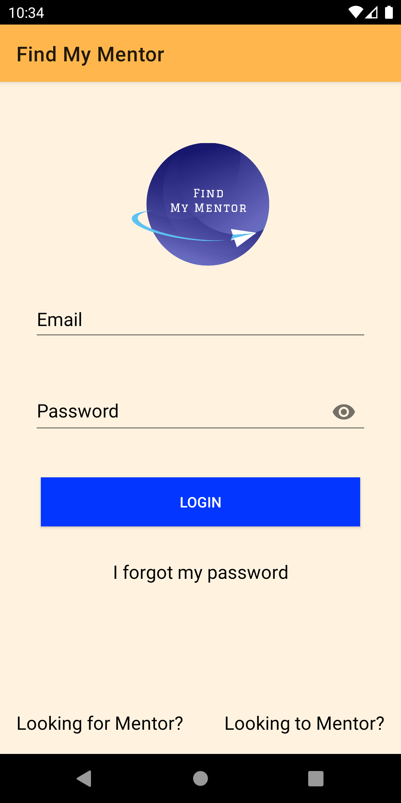
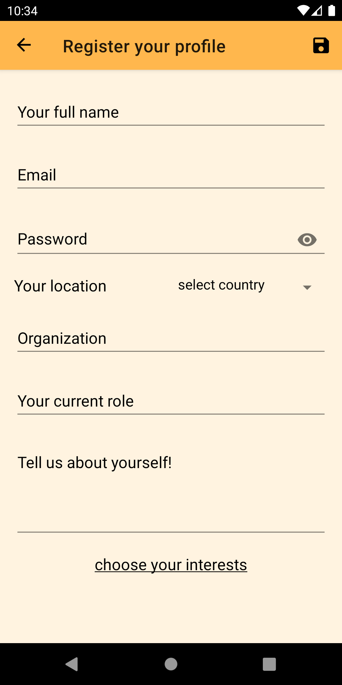
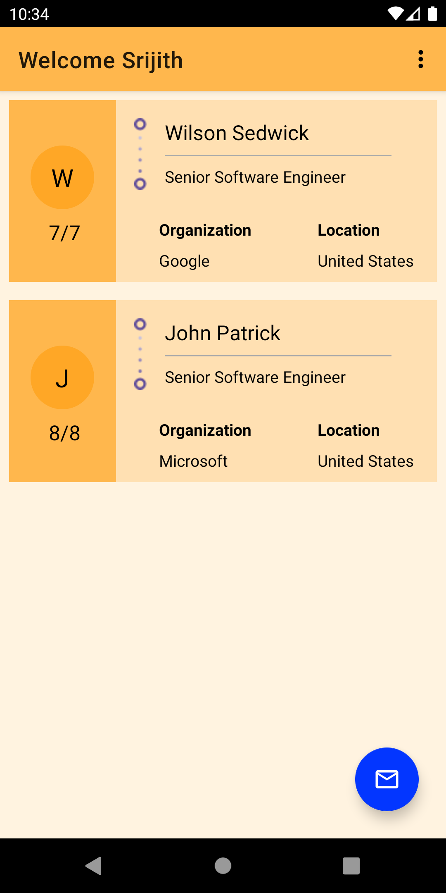
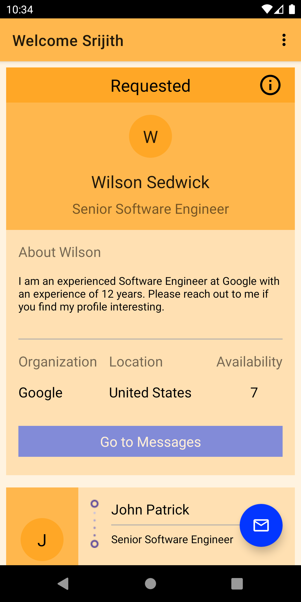
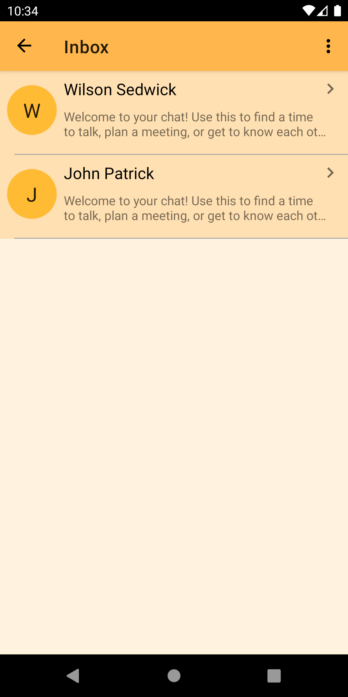
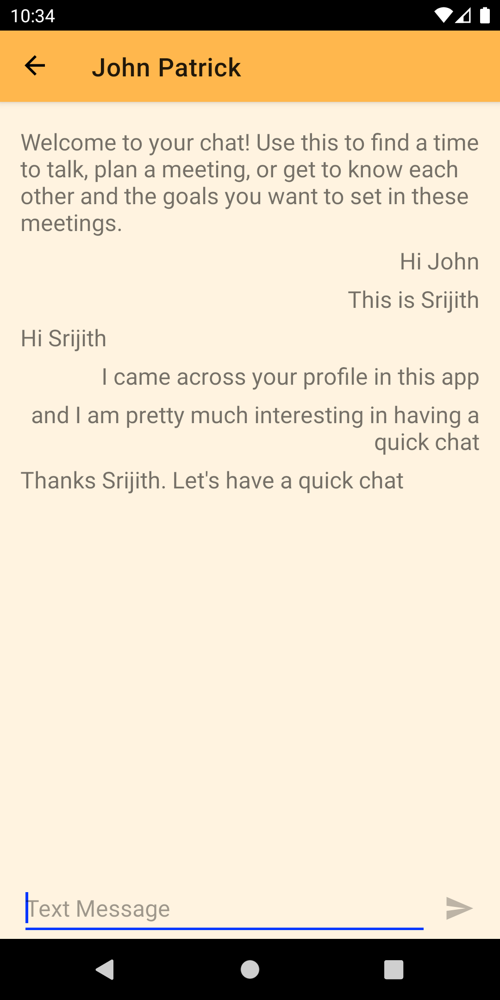
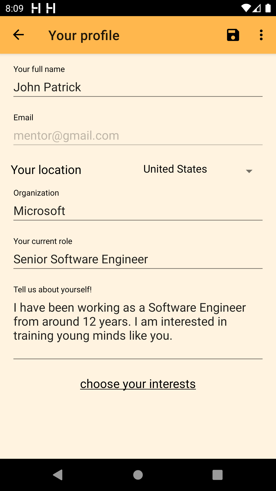
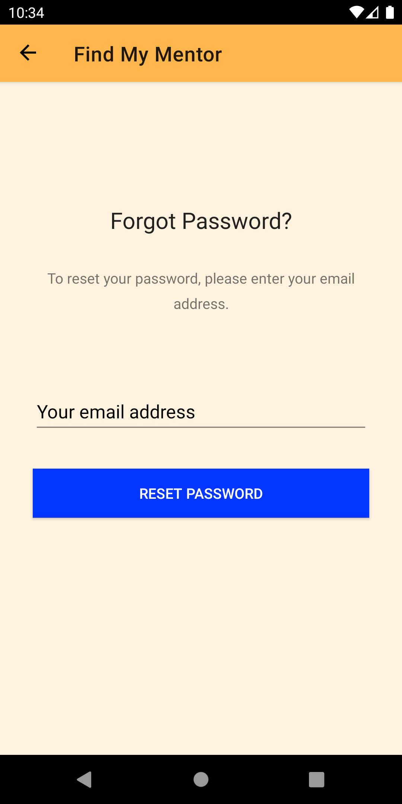

## Find My Mentor

Find My Mentor is a Material design client for Android which lets the you to look for mentors that are constantly giving you feedback on ways to improve yourself. Many people find it very beneficial to look for a mentor outside of their team to help them figure out what they have to do to thrive in their first few years, or just want someone to talk to outside of their team about frustrations or issues they’re having. If you’re interested in finding a mentor to work with about these kinds of things, please download the app and start looking for a Mentor. It’s really easy to find someone, and can offer a perspective from someone who has already gone through the hardships of being the new person and how to grow at the company. It is useful and it can make a huge difference in how much you enjoy your work and how quickly you grow during your first few years at your workplace.

Features:

* App allows Mentees and Mentors to register their profiles and start using the app.
* Mentees can browse through Mentors profiles and send request to the interested Mentors.
* Mentors can review the requests and respond to them if interested.
* App allows real time texting between mentees and Mentors

### Setup
**Requirements**
- Latest Android SDK tools
- Latest Android platform tools
- Android SDK 29
- AndroidX

**Running the app**
- Download/clone the project
- Open the project in Android Studio
- You are all set, start running the app.

### Screenshots

